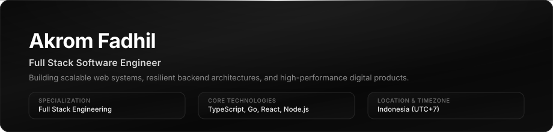

<div align="center">
  
</div>

<br/>

<div align="center">

<a href="https://readme-typing-svg.demolab.com?font=Fira+Code&weight=600&size=20&duration=3000&pause=1200&color=FFFFFF&center=true&vCenter=true&width=620&height=50&lines=Full+Stack+Software+Engineer;Building+Scalable+Web+Architectures;Crafting+High-Performance+Backend+APIs;TypeScript+%E2%80%A2+React+%E2%80%A2+Next.js+%E2%80%A2+Go+%E2%80%A2+Node.js">
  
</a>

<p align="center">
  <a href="mailto:akromfadhil234@gmail.com">
    
  </a>
  &nbsp;&nbsp;
  <a href="https://github.com/Akrmfdhl">
    
  </a>
  &nbsp;&nbsp;
  <a href="https://www.linkedin.com/in/akrom-fadhil-aa5a0a314">
    
  </a>
</p>

</div>

---

### About

<table>
  <tr>
    <td width="55%" valign="top">
      <h4>Profile</h4>
      <p>Full stack software engineer focused on building decoupled, resilient web systems and scalable backend architectures. Driven by clean design principles, maintainability, and end-to-end performance.</p>
    </td>
    <td width="45%" valign="top">
      <h4>Core Competencies</h4>
      <p>
        <b>Architecture:</b> Distributed Systems, Microservices, REST &amp; GraphQL<br/>
        <b>Engineering:</b> High-throughput APIs, Database Optimization<br/>
        <b>Interface:</b> Accessible, responsive, and tactile web applications
      </p>
    </td>
  </tr>
</table>

---

### Tech Stack

<div align="center">
  <a href="https://skillicons.dev">
    
  </a>
</div>

---

### Analytics

<!-- START_SECTION:analytics -->
```text
[ REPOSITORY LANGUAGE DISTRIBUTION ]
PHP            ████████████████████  68.2% (138.8 MB)
TypeScript     ████░░░░░░░░░░░░░░░░  16.4% (3.2 MB)
CSS / HTML     ███░░░░░░░░░░░░░░░░░  12.1% (2.4 MB)
Blade          █░░░░░░░░░░░░░░░░░░░   3.3% (636.0 KB)

[ PRODUCTIVE TIME DISTRIBUTION (UTC+7) ]
Morning   (06:00 - 12:00)  ██████████████░░░░░░  44.4%
Afternoon (12:00 - 18:00)  ████████████░░░░░░░░  33.3%
Evening   (18:00 - 00:00)  ███████░░░░░░░░░░░░░  22.3%
Night     (00:00 - 06:00)  ░░░░░░░░░░░░░░░░░░░░   0.0%

[ PROFILE SNAPSHOT ]
Public Repositories : 8
Primary Languages   : TypeScript, PHP, Go
Timezone            : Asia/Jakarta (UTC+7)
Status              : Active Committer
```
<!-- END_SECTION:analytics -->

---

### Contributions

<div align="center">
  <picture>
    <source media="(prefers-color-scheme: dark)" srcset="https://raw.githubusercontent.com/Akrmfdhl/Akrmfdhl/output/snake-dark.svg">
    <source media="(prefers-color-scheme: light)" srcset="https://raw.githubusercontent.com/Akrmfdhl/Akrmfdhl/output/snake.svg">
    
  </picture>
</div>
